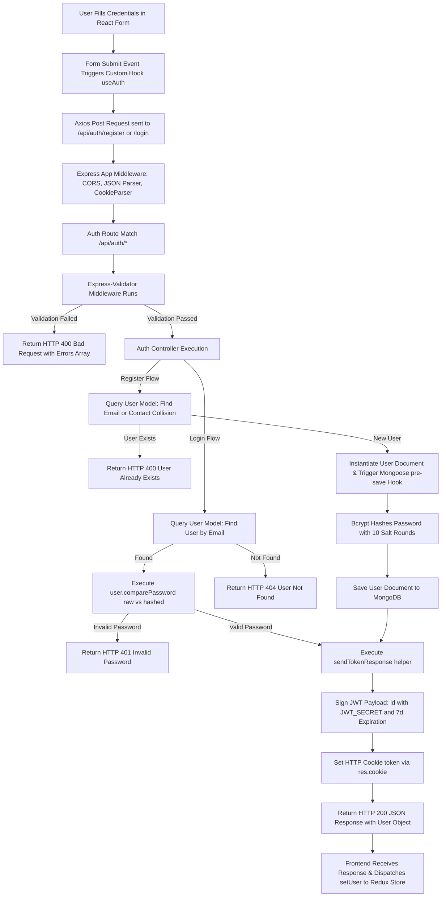
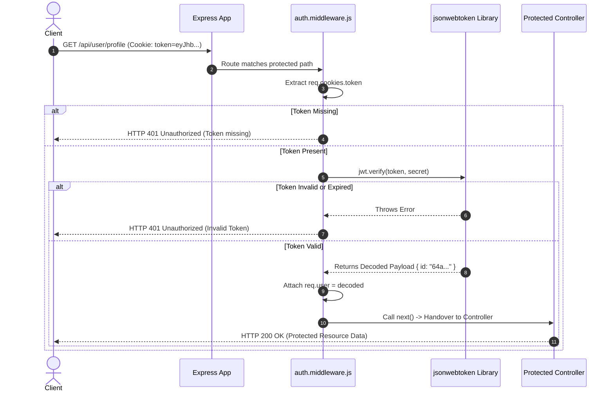
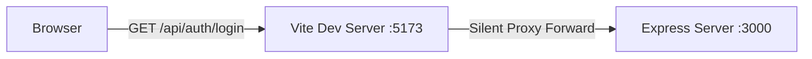

# Enterprise Authentication Architecture & Engineering Handbook

> **Project:** Snitch E-Commerce Platform  
> **Author:** Senior Software Architecture & Security Engineering Team  
> **Document Version:** 1.0.0  
> **Classification:** Internal Technical Standard & Blueprint  

---

## Executive Summary

This handbook details the complete architectural design, security mechanisms, request-response lifecycles, and operational procedures for the Authentication System implemented within the **Snitch** application repository.

This document serves dual purposes:
1. **System Documentation:** Explaining *how* and *why* the existing authentication infrastructure operates.
2. **Replication Blueprint:** Providing a step-by-step engineering standard to recreate this exact authentication system in future Node.js / Express / React microservices or monolith applications.

---

## 1. Project Overview

### 1.1 Authentication Architecture

The Snitch application utilizes a **Decoupled Stateless-Token with Cookie-Transport** authentication model. The system cleanly separates concerns between:
- **Frontend Presentation Layer (React + Redux Toolkit + Axios):** Manages user interactions, form validation, state persistence across page reloads, and HTTP request dispatching.
- **Backend API Gateway & Business Layer (Express + MongoDB + Mongoose):** Handles request routing, body validation via Express-Validator, password hashing via Bcrypt, token issuance via JSON Web Tokens (JWT), and database operations.

```
+-------------------------------------------------------+
|                    Client (Browser)                   |
|  React UI -> Redux Toolkit State -> Axios API Client  |
+-------------------------------------------------------+
                           |
                     HTTP Request
            (Credentials: true, Cookies)
                           v
+-------------------------------------------------------+
|                    Express Backend                    |
|  Morgan -> Cors -> BodyParser -> CookieParser -> Router|
+-------------------------------------------------------+
                           |
                           v
+-------------------------------------------------------+
|                  Security & Services                  |
| Express-Validator -> Auth Controller -> Mongoose Model|
+-------------------------------------------------------+
                           |
                           v
+-------------------------------------------------------+
|                   Database / Storage                  |
|                 MongoDB (User Schema)                 |
+-------------------------------------------------------+
```

### 1.2 Authentication Strategy: Cookie-Based JWT vs. Session

The system employs a **Hybrid JWT-Cookie Strategy**:

* **JWT (JSON Web Token):** Serves as the self-contained proof of authentication. It encapsulates the user's immutable identity attributes (`user.id`) and expiration time into a cryptographically signed payload.
* **HTTP-Only Cookies:** Acts as the secure delivery and storage vessel for the JWT. Rather than exposing the JWT to client-side JavaScript (e.g., via `localStorage` or `sessionStorage`), the token is transmitted in the `Set-Cookie` HTTP header.

#### Why This Approach Was Chosen

| Criteria | LocalStorage + JWT | Express Session (Redis/DB) | Cookie-Transported JWT (Chosen) |
| :--- | :--- | :--- | :--- |
| **XSS Resistance** | ❌ Vulnerable (JS can read storage) | ✅ Secure (HttpOnly) | ✅ **Secure (HttpOnly)** |
| **CSRF Vulnerability** | ✅ Immune (Headers required) | ❌ Vulnerable (Requires CSRF token) | ⚠️ Requires `SameSite` & CORS configuration |
| **Backend State** | ✅ Stateless | ❌ Stateful (Requires session store lookup) | ✅ **Stateless (Scales horizontally)** |
| **Mobile API Readiness** | ⚠️ Needs separate header transport | ❌ Harder for non-browser clients | ✅ **Payload easily reusable via Headers or Cookies** |

### 1.3 Tech Stack Breakdown

#### Backend
- **Node.js (v18+)**: Non-blocking asynchronous I/O runtime.
- **Express.js (v4.x)**: Minimalist Web framework providing middleware chaining.
- **MongoDB & Mongoose (v8.x)**: Document database and Object Data Modeling (ODM) layer for enforcing strict schemas, indexes, and hooks.
- **Bcrypt.js (v3.x)**: Adaptive hashing function implementing key-stretching (Blowfish cipher) for raw password storage.
- **JSONWebToken (jsonwebtoken v9.x)**: Cryptographic signature implementation using HMAC-SHA256 (`HS256`).
- **Express-Validator (v7.x)**: Middleware wrapping `validator.js` for declarative input sanitization and verification.
- **Cookie-Parser & CORS**: Header processing and cross-origin security context configuration.

#### Frontend
- **React (v19)**: Declarative UI layer.
- **Redux Toolkit (@reduxjs/toolkit v2.x)**: Centralized immutable state management for storing active user sessions.
- **Axios (v1.x)**: Promise-based HTTP client pre-configured with `withCredentials: true` for automatic browser cookie transmission.

---

## 2. Folder Structure

Below is the directory hierarchy of the Snitch codebase, demonstrating a modular, feature-oriented structure.

```
Snitch/
├── Backend/
│   ├── .env
│   ├── package.json
│   ├── server.js
│   └── src/
│       ├── app.js
│       ├── config/
│       │   ├── config.js
│       │   └── db.js
│       ├── controllers/
│       │   └── auth.controller.js
│       ├── models/
│       │   └── user.model.js
│       ├── routes/
│       │   └── auth.routes.js
│       └── validator/
│           └── auth.validator.js
└── Frontend/
    ├── .env
    ├── package.json
    ├── vite.config.js
    └── src/
        ├── app/
        │   ├── App.css
        │   ├── App.jsx
        │   ├── app.routers.jsx
        │   └── app.store.js
        └── features/
            └── auth/
                ├── hook/
                │   └── useAuth.js
                ├── pages/
                │   ├── login.jsx
                │   └── Register.jsx
                ├── service/
                │   └── auth.api.js
                └── state/
                    └── auth.slice.js
```

### 2.1 Backend Layer Responsibilities

* **`Backend/server.js`**: **Application Entry Point.** Loads environment variables, connects to the MongoDB database via Mongoose, and starts the HTTP server listener.
* **`Backend/src/app.js`**: **Express Application Configurator.** Assembles global middleware (`morgan`, `express.json`, `cookieParser`, `cors`) and mounts feature routers (e.g., `/api/auth`).
* **`Backend/src/config/`**:
  * `config.js`: **Centralized Config & Env Validation.** Reads `process.env`, validates required environment variables (`MONGO_URI`, `JWT_SECRET`), and exports a immutable configuration object. Exits early if secrets are missing.
  * `db.js`: **Database Connection Handler.** Encapsulates Mongoose database connection logic and handles connection errors.
* **`Backend/src/controllers/`**:
  * `auth.controller.js`: **HTTP Request Handlers.** Parses request data, calls models, triggers password verification, issues JWTs, sets HTTP response headers/cookies, and returns formatted JSON responses.
* **`Backend/src/models/`**:
  * `user.model.js`: **Data Schema & Business Security Hooks.** Defines user properties, indexes (`unique`), Mongoose `pre('save')` hooks for automated password hashing, and instance methods for bcrypt password verification.
* **`Backend/src/routes/`**:
  * `auth.routes.js`: **URL Route Routing.** Maps HTTP verbs (`POST`) and endpoints (`/register`, `/login`) to specific validation middleware and controller functions.
* **`Backend/src/validator/`**:
  * `auth.validator.js`: **Input Validation Middleware.** Defines array of validation chains using `express-validator` to inspect request bodies before hitting controllers.

### 2.2 Frontend Layer Responsibilities

* **`Frontend/src/app/`**:
  * `app.store.js`: Central Redux store configuration combining feature slices.
  * `app.routers.jsx`: Client-side route declarations using React Router DOM.
* **`Frontend/src/features/auth/`**:
  * `service/auth.api.js`: Axios instance preconfigured with base API paths and `withCredentials: true`.
  * `hook/useAuth.js`: Custom React Hook encapsulating Redux dispatch actions and API calls for components.
  * `state/auth.slice.js`: Redux slice defining auth state (`user`, `loading`, `error`) and reducers.
  * `pages/`: UI view components (`login.jsx`, `Register.jsx`).

---

## 3. Authentication Flow

The diagram below illustrates the end-to-end user authentication workflow.



---

## 4. Request Lifecycle

Here is the exact lifecycle of an HTTP request traversing through every component of the backend system:

```
[ Client Browser ]
       | (HTTP POST /api/auth/login)
       v
[ Express Listener (server.js) ]
       |
[ Global Middleware Stack (app.js) ]
  ├── 1. Morgan (Log HTTP request details)
  ├── 2. Express.json (Parse JSON body into req.body)
  ├── 3. Express.urlencoded (Parse URL-encoded forms)
  ├── 4. CookieParser (Parse Cookie header into req.cookies)
  └── 5. CORS (Verify Origin: http://localhost:5173, Allow Credentials)
       |
[ Route Dispatcher (routes/auth.routes.js) ]
  └── Matches '/api/auth/login'
       |
[ Validation Middleware Array (validator/auth.validator.js) ]
  ├── 1. Check req.body.email is valid email format
  ├── 2. Check req.body.password is min 6 characters
  └── 3. Validation result evaluator:
         If errors -> Abort & Return res.status(400).json({ errors })
         If clean  -> Call next()
       |
[ Controller Handler (controllers/auth.controller.js -> login) ]
  ├── 1. Extract email, password from req.body
  ├── 2. Mongoose Query: userModel.findOne({ email })
  ├── 3. Password Verification: user.comparePassword(password)
  └── 4. Helper Invocation: sendTokenResponse(user, res, message)
       |
[ Helper: sendTokenResponse ]
  ├── 1. jwt.sign({ id: user.id }, secret, { expiresIn: '7d' })
  ├── 2. res.cookie('token', token)
  └── 3. res.status(200).json({ message, success: true, user })
       |
[ HTTP Response Transmitted ]
       | (Headers include: Set-Cookie: token=eyJhbG...; Path=/)
       v
[ Client Browser / Axios Receiver ]
```

---

## 5. Register Flow

### Detailed Step Breakdown

1. **Validation Layer (`validateRegisterUser`):**
   * Inspects `req.body.email`: Must be a valid email string.
   * Inspects `req.body.password`: Minimum 6 characters.
   * Inspects `req.body.fullname`: Minimum 3 characters.
   * Inspects `req.body.contact`: Exactly 10 digits required.
   * Inspects `req.body.isSeller`: Must be boolean.
   * If any validation fails, the request is short-circuited before touching controller logic.

2. **Collision Check (`userModel.findOne`):**
   * Queries MongoDB with an `$or` operator:
     ```js
     const existingUser = await userModel.findOne({
         $or: [{ email }, { contact }]
     });
     ```
   * If a record exists, returns HTTP 400 with message `"User already exists with this email or contact"`.

3. **User Creation & Password Hashing:**
   * Calls `userModel.create({...})`.
   * Triggers Mongoose `pre("save")` middleware:
     ```js
     userSchema.pre("save", async function () {
         if (!this.isModified("password")) return;
         this.password = await bcrypt.hash(this.password, 10);
     });
     ```
   * Plaintext password is salt-hashed with cost factor 10 before document write.

4. **Token Generation & Response Dispatch:**
   * Invokes `sendTokenResponse(user, res, "user registered successfully")`.
   * Encodes `user.id` into JWT signed with `config.jwt_secret`.
   * Sets response cookie named `token`.
   * Returns HTTP 200 with sanitized user object (excluding password hash).

> [!IMPORTANT]
> **Edge Case:** If database write fails (e.g., duplicate index race condition), the `catch` block catches the exception and returns HTTP 500 `"Internal Server error"`.

---

## 6. Login Flow

### Detailed Step Breakdown

1. **Input Validation (`validateLoginUser`):**
   * Verifies email format and password length requirement.

2. **Account Retrieval:**
   * Queries `userModel.findOne({ email })`.
   * If `user` is `null`, returns HTTP 404 `"user not found"`.

3. **Hash Comparison:**
   * Calls instance method `user.comparePassword(password)`:
     ```js
     userSchema.methods.comparePassword = async function (password) {
         return await bcrypt.compare(password, this.password);
     }
     ```
   * `bcrypt.compare` extracts the salt from `this.password` and hashes the input `password` to check for match.
   * If mismatch, returns HTTP 401 `"Invalid password"`.

4. **Token Issue & Cookie Set:**
   * Returns signed JWT in `token` cookie and sends HTTP 200 JSON payload containing user details (`id`, `email`, `contact`, `fullname`, `role`).

---

## 7. Logout Flow

*(Architecture Specification for System Complete Implementation)*

### Implementation Specification

To perform a complete logout, the server must clear the HTTP authentication cookie.

```js
// Controllers: auth.controller.js
export const logout = async (req, res) => {
    res.clearCookie("token", {
        httpOnly: true,
        secure: process.env.NODE_ENV === "production",
        sameSite: "lax"
    });
    return res.status(200).json({
        success: true,
        message: "Logged out successfully"
    });
};
```

#### Security Considerations
* **Client-side state invalidation:** Frontend must dispatch Redux actions (`setUser(null)`) to clear user object from application state.
* **Cookie Erasure:** `res.clearCookie` sends an expired `Set-Cookie` header (`Max-Age=0`) forcing browser deletion.

---

## 8. Protected Route Flow

To protect authenticated endpoints (e.g., `/api/user/profile`, `/api/orders`), an authentication middleware is required.

### Sequence Diagram



### Production Implementation Reference

```js
// middleware/auth.middleware.js
import jwt from "jsonwebtoken";
import { config } from "../config/config.js";

export const protect = async (req, res, next) => {
    try {
        const token = req.cookies.token;
        if (!token) {
            return res.status(401).json({ message: "Not authorized, no token provided" });
        }

        const decoded = jwt.verify(token, config.jwt_secret);
        req.user = decoded; // Contains { id: user.id }
        next();
    } catch (error) {
        return res.status(401).json({ message: "Not authorized, token failed or expired" });
    }
};
```

---

## 9. Middleware Documentation

Middleware functions sit in the Express request pipeline between incoming requests and route controllers.

### 9.1 Morgan Logging Middleware
* **Purpose:** HTTP request logger for development debugging.
* **Input:** Raw HTTP Request stream.
* **Execution Order:** 1 (First global middleware).
* **Output:** Console output (e.g., `POST /api/auth/login 200 45.123 ms`).

### 9.2 Body Parsers (`express.json` & `express.urlencoded`)
* **Purpose:** Parses incoming JSON and URL-encoded request bodies.
* **Input:** HTTP Request Stream with `Content-Type: application/json`.
* **Execution Order:** 2 & 3.
* **Output:** Populates `req.body` object.

### 9.3 Cookie Parser (`cookie-parser`)
* **Purpose:** Extracts HTTP `Cookie` headers and converts raw cookie strings into accessible JavaScript objects.
* **Input:** `Cookie: token=eyJhbG...` header.
* **Execution Order:** 4.
* **Output:** Populates `req.cookies` object (e.g., `req.cookies.token`).

### 9.4 Cross-Origin Resource Sharing (`cors`)
* **Purpose:** Configures cross-origin access control headers allowing frontends on separate ports/domains to send HTTP requests with cookies.
* **Configuration:**
  ```js
  cors({
      origin: "http://localhost:5173",
      credentials: true
  })
  ```
* **Execution Order:** 5.
* **Output:** Adds `Access-Control-Allow-Origin: http://localhost:5173` and `Access-Control-Allow-Credentials: true` response headers.

### 9.4.1 Development Proxy Architecture (Vite Dev Server) vs. Production Strategy

#### 1. Development Proxy Mechanism (Vite Dev Server)
In local development, the Axios API service is configured with a relative base URL without a hardcoded protocol, domain, or port:

```js
// Frontend: src/features/auth/service/auth.api.js
const authApiInstance = axios.create({
    baseURL: "/api/auth", // Relative path without domain or port
    withCredentials: true
});
```

When Axios dispatches a request (e.g., `/api/auth/login`), the browser resolves it against the origin of the React development server:
`http://localhost:5173/api/auth/login`

To eliminate hardcoded backend URLs and bypass CORS preflight checks during development, Vite is configured with a dev server proxy in `vite.config.js`:

```js
// Frontend: vite.config.js
export default defineConfig({
  plugins: [react(), tailwindcss()],
  server: {
    proxy: {
      "/api": {
        target: "http://localhost:3000",
        changeOrigin: true,
        secure: false,
      }
    }
  }
})
```

#### 2. Request Routing & CORS Bypassing in Development

When Vite Dev Server receives a request matching `/api`, it intercepts and silently forwards (proxies) the request to the Express server running on port `3000`.



**Browser Perspective:**
* **Origin:** `http://localhost:5173`
* **Destination:** `http://localhost:5173`
* **Security Result:** **Same-Origin request!** The browser believes it is communicating exclusively with port 5173. Consequently, browser CORS checks (`OPTIONS` preflight) are bypassed completely in local development.

---

> [!WARNING]
> **CRITICAL ARCHITECTURAL REQUIREMENT: Vite Dev Server Proxy is ONLY for Local Development!**
>
> The `server.proxy` configuration in `vite.config.js` **only runs during local development** when executing `vite dev`.
> When building the application for production (`npm run build` / `vite build`), Vite compiles static minified HTML, CSS, and JS files. **The Vite dev server proxy does NOT exist in production!**

---

#### 3. Production Deployment Strategies (What to do for Production)

For production deployments, software architecture requires choosing one of two production deployment patterns:

##### Strategy A: Reverse Proxy at Web Server Level (Recommended - Maintains Same-Origin)
Deploy your built React static assets behind a production Web server or Gateway (e.g., **Nginx**, **Caddy**, **Cloudflare Workers**, or **Vercel / Netlify Rewrites**).

The production Web server handles routing:
- All static routes (`/`, `/login`, `/assets/*`) serve the built React single-page app.
- All `/api/*` routes are reverse-proxied internally to the Node.js / Express backend container (`http://backend-service:3000`).

**Example Nginx Configuration (`nginx.conf`):**
```nginx
server {
    listen 80;
    server_name myapp.com;

    # Serve React Frontend Static Build
    location / {
        root /usr/share/nginx/html;
        try_files $uri $uri/ /index.html;
    }

    # Reverse Proxy API requests to Node.js Backend Container
    location /api/ {
        proxy_pass http://localhost:3000/api/;
        proxy_http_version 1.1;
        proxy_set_header Upgrade $http_upgrade;
        proxy_set_header Connection 'upgrade';
        proxy_set_header Host $host;
        proxy_cache_bypass $http_upgrade;
    }
}
```
* **Advantage:** Preserves relative `baseURL: "/api/auth"` in client code. The browser continues to see Same-Origin (`https://myapp.com`), allowing HttpOnly authentication cookies to work without third-party cross-site cookie restrictions.

##### Strategy B: Environment Variable Dynamic Base URL (Cross-Domain Setup)
If the frontend and backend are hosted on separate domains or subdomains in production (e.g. Frontend on `https://app.mysite.com` and Backend API on `https://api.mysite.com`):

1. **Configure Environment-Driven `baseURL` in Axios:**
   ```js
   const authApiInstance = axios.create({
       baseURL: `${import.meta.env.VITE_API_URL || ""}/api/auth`,
       withCredentials: true
   });
   ```
2. **Set Production Environment Variable (`.env.production`):**
   ```env
   VITE_API_URL=https://api.mysite.com
   ```
3. **Configure Backend CORS for Cross-Domain Credentials:**
   In Express `app.js`, explicitly whitelist the production frontend domain:
   ```js
   app.use(cors({
       origin: "https://app.mysite.com",
       credentials: true
   }));
   ```
4. **Configure Production Cookie Flags for Cross-Site Delivery:**
   ```js
   res.cookie("token", token, {
       httpOnly: true,
       secure: true, // Required for HTTPS
       sameSite: "none" // Required for cross-subdomain / cross-origin cookie delivery
   });
   ```

### 9.5 Express-Validator Validation Middleware
* **Purpose:** Sanitizes and asserts correctness of request payload fields before reaching controllers.
* **Input:** `req.body`.
* **Output:** Next execution step if clean; HTTP 400 Bad Request if invalid.

---

## 10. Controllers

Controllers process HTTP requests, execute application logic, and generate responses.

### 10.1 `register` (`controllers/auth.controller.js`)
* **Responsibilities:** Check duplicate records, create user instance, execute JWT issue helper.
* **Input:** `req.body` (`email`, `contact`, `password`, `fullname`, `isSeller`).
* **Output:** HTTP 200 (Success), HTTP 400 (Validation/Collision), HTTP 500 (Internal Error).
* **Why Logic Belongs Here:** Acts as the coordinator between database models and HTTP responses.

### 10.2 `login` (`controllers/auth.controller.js`)
* **Responsibilities:** Retrieve user by email, call password comparison instance method, execute token issue helper.
* **Input:** `req.body` (`email`, `password`).
* **Output:** HTTP 200 (Success), HTTP 401 (Invalid password), HTTP 404 (User not found), HTTP 500 (Server error).

### 10.3 `sendTokenResponse` Helper
* **Responsibilities:** Signs JWT with `user.id`, sets `res.cookie('token', token)`, returns unified JSON user object.

> [!WARNING]
> **Controller anti-pattern:** Never write direct database queries or raw password cryptographic comparisons inside routes directly. Controllers must delegate data logic to Models/Services.

---

## 11. Services

### Why Services Exist

In larger scale software architecture, the **Service Layer** decouples business logic from HTTP transport mechanisms (Express `req`, `res`). While Snitch currently combines business operations inside controllers, migrating to a dedicated Service layer offers major advantages:

```
[ Express Route ] ---> [ Controller (Parses req, res) ] ---> [ Auth Service (Pure Business Logic) ] ---> [ Database Model ]
```

#### Advantages of Service Layer
1. **Reusability:** The exact same authentication service function (`AuthService.loginUser`) can be called by an HTTP API, a GraphQL resolver, a WebSockets listener, or a CLI script.
2. **Testability:** Business logic can be unit-tested in isolation without mocking Express `req` and `res` objects.

---

## 12. Database Models

The user data structure is defined in `Backend/src/models/user.model.js`.

### 12.1 Schema Definition Table

| Field Name | Data Type | Required | Unique | Default | Allowed Values / Validation |
| :--- | :--- | :--- | :--- | :--- | :--- |
| `_id` | ObjectId | Auto | True | Auto | MongoDB Primary Key |
| `email` | String | True | True | - | Must be unique, valid email format |
| `password` | String | True | False | - | Bcrypt hash string |
| `fullname` | String | True | False | - | Minimum 3 characters |
| `contact` | String | True | True | - | Unique phone number |
| `role` | String | False | False | `"buyer"` | Enum: `["seller", "buyer"]` |

### 12.2 Mongoose Hooks & Instance Methods

```js
// Automated Pre-Save Password Hashing Hook
userSchema.pre("save", async function () {
    if (!this.isModified("password")) return;
    this.password = await bcrypt.hash(this.password, 10);
});

// Password Verification Instance Method
userSchema.methods.comparePassword = async function (password) {
    return await bcrypt.compare(password, this.password);
};
```

---

## 13. Validation

Validation prevents corrupt, malicious, or malformed data from penetrating the core application layer.

### 13.1 Rules Matrix

```js
// Registration Rules
body("email").isEmail().withMessage("Email is required")
body("password").isLength({ min: 6 }).withMessage("Password must be at least 6 characters")
body("fullname").isLength({ min: 3 }).withMessage("Full Name must be at least 3 characters")
body("contact").isLength({ min: 10 }).withMessage("Contact must be at least 10 digit")
body("contact").isLength({ max: 10 }).withMessage("Contact must be at least 10 digit")
body("isSeller").isBoolean().withMessage("isSeller must be boolean")
```

### 13.2 Validation Middleware Execution Sequence

```js
(req, res, next) => {
    const errors = validationResult(req);
    if (!errors.isEmpty()) {
        return res.status(400).json({ errors: errors.array() });
    }
    next();
}
```

> [!NOTE]
> Running validation prior to controllers guarantees that controllers can safely assume inputs exist and conform to expected types.

---

## 14. Password Security

Password management follows strict cryptographic security principles.

### 14.1 Hashing Algorithm & Salt Rounds

* **Algorithm:** Bcrypt (Adaptive Key Derivation Function based on the Blowfish cipher).
* **Cost Factor (Salt Rounds):** `10`.
  * Cost 10 performs $2^{10} = 1024$ hashing iterations per password.
  * Strikes a balance between CPU execution time (~50-100ms per hash) and protection against brute-force attacks.

```
Plaintext Password ("secret123") + Unique Random Salt -> Bcrypt Hash ($2b$10$e8O...)
```

### 14.2 Salt & Verification Mechanism

Bcrypt embeds the salt and cost factor directly within the resulting hash string:
```
$2b$10$N9qo8uLOickgx2ZMRZoMyeIjZAgcfl7p92ldGxad68LJZdL17lhWy
\__/ \/ \____________________/\____________________________/
 Alg Cost       Salt (22 chars)          Hash Value (31 chars)
```
When `bcrypt.compare(plaintext, hash)` runs:
1. It parses the salt and cost factor from the stored hash.
2. It hashes the incoming `plaintext` password using that exact salt and cost.
3. It compares the resulting string with the stored hash using constant-time comparison to prevent timing attacks.

---

## 15. JWT Documentation

### 15.1 Token Payload Structure

```json
{
  "id": "66b3d4f19a0a811c7849e0b2",
  "iat": 1723035600,
  "exp": 1723640400
}
```

* **Header:** Specifies algorithm (`HS256`) and token type (`JWT`).
* **Payload:** Contains identity reference (`id`), Issued At timestamp (`iat`), and Expiry timestamp (`exp`).
* **Signature:** HMAC-SHA256 hash of `base64(Header) + "." + base64(Payload)` using `JWT_SECRET`.

### 15.2 Expiration Strategy
* Tokens are configured with a `7d` (7-day) validity window.
* Tokens are self-verifying and require no database lookup during request validation.

---

## 16. Cookie Documentation

Cookies are the secure mechanism for storing JWTs in client browsers.

### 16.1 Attribute Matrix

| Option | Value in Snitch | Recommended Production Value | Security Purpose |
| :--- | :--- | :--- | :--- |
| `httpOnly` | Implicit Default (Off) | `true` | Prevents client-side JS (`document.cookie`) from reading the token (Neutralizes XSS token theft). |
| `secure` | Implicit Default (Off) | `true` | Forces cookie to be transmitted ONLY over encrypted HTTPS connections. |
| `sameSite` | Implicit Default (`Lax`) | `"lax"` or `"strict"` | Mitigates Cross-Site Request Forgery (CSRF) by restricting cross-site cookie transmission. |
| `maxAge` | Unset (Session Cookie) | `7 * 24 * 60 * 60 * 1000` (7 days) | Defines exact cookie expiration time matching JWT `expiresIn`. |

---

## 17. Environment Variables

### Environment Configuration Schema

| Variable Name | Purpose | Required | Example Value | Security Notes |
| :--- | :--- | :--- | :--- | :--- |
| `PORT` | Node HTTP Server Port | Yes | `3000` | Non-sensitive server port configuration. |
| `MONGO_URI` | MongoDB Connection String | Yes | `mongodb://127.0.0.1:27017/snitch` | Contains database host, port, credentials. Never commit to Git. |
| `JWT_SECRET` | Secret key for JWT signing | Yes | `c8e19b67f3a8b41...` | High-entropy cryptographic string. Minimum 32 characters. |
| `VITE_API_URL` | Frontend API Base Route | Yes | `http://localhost:3000/` | Configured in React `.env` for Axios calls. |

---

## 18. API Documentation

### 18.1 POST `/api/auth/register`

* **Description:** Creates a new user account (buyer or seller) and sets authentication cookie.
* **Authentication Required:** No.
* **Headers:** `Content-Type: application/json`

#### Request Body
```json
{
  "email": "user@example.com",
  "contact": "9876543210",
  "password": "Password123",
  "fullname": "John Doe",
  "isSeller": false
}
```

#### Success Response (`HTTP 200 OK`)
```json
{
  "message": "user registered successfully",
  "success": true,
  "user": {
    "id": "66b3d4f19a0a811c7849e0b2",
    "email": "user@example.com",
    "contact": "9876543210",
    "fullname": "John Doe",
    "role": "buyer"
  }
}
```

#### Failure Responses

##### Validation Error (`HTTP 400 Bad Request`)
```json
{
  "errors": [
    {
      "type": "field",
      "value": "123",
      "msg": "Password must be at least 6 characters",
      "path": "password",
      "location": "body"
    }
  ]
}
```

##### Duplicate User (`HTTP 400 Bad Request`)
```json
{
  "message": "User already exists with this email or contact"
}
```

---

### 18.2 POST `/api/auth/login`

* **Description:** Authenticates user credentials and sets authentication cookie.
* **Authentication Required:** No.
* **Headers:** `Content-Type: application/json`

#### Request Body
```json
{
  "email": "user@example.com",
  "password": "Password123"
}
```

#### Success Response (`HTTP 200 OK`)
```json
{
  "message": "Login successfully",
  "success": true,
  "user": {
    "id": "66b3d4f19a0a811c7849e0b2",
    "email": "user@example.com",
    "contact": "9876543210",
    "fullname": "John Doe",
    "role": "buyer"
  }
}
```

#### Failure Responses

##### User Not Found (`HTTP 404 Not Found`)
```json
{
  "message": "user not found"
}
```

##### Invalid Password (`HTTP 401 Unauthorized`)
```json
{
  "message": "Invalid password"
}
```

---

## 19. Error Handling

### Status Code Mapping Standard

| Status Code | Category | Scenario | Format |
| :--- | :--- | :--- | :--- |
| **400** | Bad Request | Validation errors, duplicate email/contact | `{ errors: [...] }` or `{ message: "..." }` |
| **401** | Unauthorized | Incorrect password, missing or invalid JWT | `{ message: "Invalid password" }` |
| **404** | Not Found | User record does not exist on login | `{ message: "user not found" }` |
| **500** | Server Error | Unhandled server/database exceptions | `{ message: "Internal Server error" }` |

---

## 20. Security Best Practices

### Defensive Controls Matrix

1. **Password Hashing:** Always use Bcrypt with minimum 10 rounds. Never log or store raw passwords.
2. **JWT Security:** Keep `JWT_SECRET` long and random. Never place sensitive PII (passwords, payment data) in JWT payload.
3. **Cookie Security:** Enforce `httpOnly: true`, `secure: true` (in production), and `sameSite: "lax"`.
4. **CORS Hardening:** Never use `origin: "*"` when `credentials: true` is enabled. Explicitly restrict allowed origins to client domains.
5. **CSRF Protection:** Secure cookie transport combined with strict CORS headers.
6. **XSS Protection:** Sanitize inputs and rely on HttpOnly cookies to prevent script-based token access.
7. **Rate Limiting:** Implement `express-rate-limit` on authentication endpoints to prevent brute-force attacks.

---

## 21. Complete Authentication Sequence Diagram

Below is the complete sequence diagram illustrating interactions across all layers:


---

## 22. Rebuilding Guide

Follow this step-by-step checklist to build this exact authentication system in any future project from scratch.

### Phase 1: Environment & Express Setup
- [ ] **Step 1:** Initialize Node project (`npm init -y`) and set `"type": "module"` in `package.json`.
- [ ] **Step 2:** Install backend dependencies:
  ```bash
  npm install express dotenv mongoose bcrypt jsonwebtoken express-validator cookie-parser cors morgan
  ```
- [ ] **Step 3:** Create `.env` file with `PORT`, `MONGO_URI`, and `JWT_SECRET`.
- [ ] **Step 4:** Build `src/config/config.js` to parse and validate required `.env` keys.
- [ ] **Step 5:** Create `src/config/db.js` for Mongoose MongoDB connection management.
- [ ] **Step 6:** Set up `src/app.js` with `morgan`, `express.json`, `cookieParser`, and `cors` with `credentials: true`.

### Phase 2: Data Models & Validation
- [ ] **Step 7:** Create `src/models/user.model.js`.
- [ ] **Step 8:** Define schema fields (`email`, `password`, `fullname`, `contact`, `role`).
- [ ] **Step 9:** Attach `pre("save")` hook for bcrypt password hashing.
- [ ] **Step 10:** Attach `userSchema.methods.comparePassword` for bcrypt hashing comparison.
- [ ] **Step 11:** Create `src/validator/auth.validator.js` with rules for registration and login.

### Phase 3: Controllers & Routing
- [ ] **Step 12:** Create `src/controllers/auth.controller.js`.
- [ ] **Step 13:** Implement `sendTokenResponse` helper to sign JWT and set response cookies.
- [ ] **Step 14:** Implement `register` controller (duplicate check, model save, token response).
- [ ] **Step 15:** Implement `login` controller (find user, compare password, token response).
- [ ] **Step 16:** Create `src/routes/auth.routes.js` and mount routes to `/register` and `/login`.
- [ ] **Step 17:** Mount auth routes in `src/app.js` under `/api/auth`.
- [ ] **Step 18:** Create `server.js` entry point to connect DB and start listening.

### Phase 4: Frontend Integration
- [ ] **Step 19:** Initialize React app with Redux Toolkit and Axios.
- [ ] **Step 20:** Create Axios instance with relative `baseURL: "/api/auth"` and `withCredentials: true`. Configure `server.proxy` in `vite.config.js` for local development forwarding, and configure an Nginx reverse proxy or dynamic `VITE_API_URL` env variable for production deployment.
- [ ] **Step 21:** Build `auth.slice.js` for Redux state (`user`, `loading`, `error`).
- [ ] **Step 22:** Build custom hook `useAuth.js` to dispatch state updates on successful API calls.
- [ ] **Step 23:** Connect register and login form UI views to `useAuth`.

---

## 23. Common Bugs

Below is a catalog of 30 common authentication implementation errors, their root causes, and recommended solutions.

### 1. Cookies Not Saved in Browser
* **Problem:** `Set-Cookie` header is returned by backend, but browser ignores and drops the cookie.
* **Reason:** Missing `withCredentials: true` in Axios OR missing `credentials: true` / matching `origin` in Express CORS settings.
* **Solution:** Configure Axios `axios.create({ withCredentials: true })` AND Express CORS `cors({ origin: 'http://localhost:5173', credentials: true })`.

### 2. Double Password Hashing
* **Problem:** Password comparison fails even when entering the correct password.
* **Reason:** Hashing password manually inside controller AND also triggering `pre("save")` hook in Mongoose model.
* **Solution:** Perform password hashing ONLY inside the Mongoose `pre("save")` hook.

### 3. Password Hashed Again on User Profile Update
* **Problem:** Updating user profile fields (e.g. name) breaks subsequent user logins.
* **Reason:** `pre("save")` hook runs on save without checking `this.isModified("password")`.
* **Solution:** Add `if (!this.isModified("password")) return;` at top of Mongoose `pre("save")` hook.

### 4. JWT Expiration Unit Mismatch
* **Problem:** JWT expires immediately upon creation.
* **Reason:** Passing expiration in milliseconds instead of seconds or valid string format.
* **Solution:** Pass string values (e.g. `"7d"`, `"1h"`) or numeric seconds (`60 * 60`) to `jwt.sign`.

### 5. Infinite Loading State in React
* **Problem:** Login form spinner runs endlessly when an error occurs.
* **Reason:** `dispatch(setLoading(false))` is omitted inside catch block or after failed API calls.
* **Solution:** Call `dispatch(setLoading(false))` inside a `finally` block in custom hooks.

### 6. CORS Header '*' Conflict with Credentials
* **Problem:** Browser throws CORS error: *"The value of the 'Access-Control-Allow-Origin' header in the response must not be the wildcard '*' when the request's credentials mode is 'include'"*.
* **Reason:** Express CORS configured with default wildcard `origin: "*"`.
* **Solution:** Explicitly pass exact client URL string: `cors({ origin: "http://localhost:5173", credentials: true })`.

### 7. Unhandled Promise Rejections in Custom Hook
* **Problem:** Application crashes on network or HTTP 500 error.
* **Reason:** Async operations inside `useAuth.js` lack `try...catch` wrapper blocks.
* **Solution:** Wrap all API calls in `try...catch...finally` blocks inside custom hooks.

### 8. Exposing Sensitive Fields in API Responses
* **Problem:** Password hash returned in user object payload to client.
* **Reason:** Returning raw Mongoose document `res.json(user)` without field sanitization.
* **Solution:** Explicitly map allowed response fields (`id`, `email`, `fullname`, `role`).

### 9. Typo in Mongoose Instance Method Assignment
* **Problem:** `user.comparePassword is not a function` error at runtime.
* **Reason:** Defining `userSchema.method.comparePassword` instead of `userSchema.methods.comparePassword` (singular vs plural).
* **Solution:** Use `userSchema.methods.comparePassword`.

### 10. `req.cookies` Undefined
* **Problem:** Backend middleware fails to read cookies on protected routes.
* **Reason:** `cookie-parser` middleware is not mounted in `app.js` before routes.
* **Solution:** Add `app.use(cookieParser())` before mounting routes.

### 11. Storing JWT Secrets in Version Control
* **Problem:** `JWT_SECRET` leaked on public Git repositories.
* **Reason:** Hardcoding secret fallback strings inside codebase.
* **Solution:** Require secrets via environment variables and exit process if missing.

### 12. Lack of Email Case Normalization
* **Problem:** `User@Domain.com` and `user@domain.com` register as separate user accounts.
* **Reason:** Missing lowercasing sanitizer in validation or schema.
* **Solution:** Add `lowercase: true` to email field in Mongoose schema and `normalizeEmail()` in express-validator.

### 13. Hardcoded Secret Fallback Vulnerability
* **Problem:** System defaults to weak fallback secret like `"secret"` in production.
* **Reason:** Code uses `process.env.JWT_SECRET || 'secret'`.
* **Solution:** Fail hard at startup if `process.env.JWT_SECRET` is missing.

### 14. Unindexed Query Fields
* **Problem:** MongoDB query latency spikes as user collection grows.
* **Reason:** Querying by `email` or `contact` without index definitions.
* **Solution:** Ensure `unique: true` or `index: true` is defined on `email` and `contact` schema properties.

### 15. Race Condition on User Registration
* **Problem:** Duplicate records created under concurrent registration attempts.
* **Reason:** Relying solely on `findOne` application check without database-level unique constraints.
* **Solution:** Enforce unique indexes in MongoDB schema.

### 16. Missing Cookie Path Attribute
* **Problem:** Cookie is available on `/api/auth` routes but missing on `/api/user` routes.
* **Reason:** Cookie set with specific subpath scope.
* **Solution:** Set `path: "/"` explicitly when setting cookies via `res.cookie`.

### 17. Unhandled Validation Error Array
* **Problem:** Frontend crashes when receiving express-validator error object.
* **Reason:** Express-validator output structure mismatch with frontend parser expecting simple string messages.
* **Solution:** Normalize error responses on backend into standard format `{ message, errors }`.

### 18. Silent Failure on Async Mongoose Pre-Save Hook
* **Problem:** Password stored as plaintext without hashing.
* **Reason:** Forgetting `await` keyword before `bcrypt.hash()` inside `pre("save")` hook.
* **Solution:** Always `await bcrypt.hash()` in async pre-save hooks.

### 19. Using Insecure Algorithms in JWT Header
* **Problem:** JWT signature forgery via `"none"` algorithm attack vector.
* **Reason:** Using outdated JWT libraries or enabling untrusted algorithm options.
* **Solution:** Enforce algorithm whitelist (`algorithms: ['HS256']`) during token verification.

### 20. Token Replay Attacks
* **Problem:** Stolen JWT remains valid indefinitely until expiration.
* **Reason:** Lack of token revocation mechanism or excessively long expiration periods.
* **Solution:** Use short-lived access tokens (15m) paired with rotatable refresh tokens.

### 21. Express Route Mounting Order Issue
* **Problem:** Protected route middleware bypassed or static files taking precedence over routes.
* **Reason:** Declaring route handles out of order relative to middleware in `app.js`.
* **Solution:** Declare global middleware -> routes -> 404 handlers -> global error handler in strict sequence.

### 22. React Redux State Resetting on Page Refresh
* **Problem:** Authenticated user logged out when hitting F5 / Refresh in browser.
* **Reason:** Storing user session only in memory Redux store without persistent profile fetch on mount.
* **Solution:** Implement `/api/auth/me` endpoint and invoke on React app startup.

### 23. `SameSite=Strict` Blocking Cross-Domain Navigation
* **Problem:** Users redirected from external login links lose session cookies.
* **Reason:** Strict cookie isolation policy blocks cross-site top-level GET navigations.
* **Solution:** Use `SameSite=Lax` for standard Web authentication flows.

### 24. Missing HTTPS Secure Cookie Flag in Production
* **Problem:** Authentication cookies sent over plain HTTP networks, vulnerable to MITM interception.
* **Reason:** `secure` option omitted from `res.cookie()`.
* **Solution:** Conditionally set `secure: process.env.NODE_ENV === "production"`.

### 25. Incorrect Password Verification Error Message Exposing Account Existence
* **Problem:** Returning `"User does not exist"` on login form.
* **Reason:** Disclosing whether an email address is registered.
* **Solution:** Return generic error message `"Invalid credentials"` for both email non-existence and password mismatch in production.

### 26. `express-validator` Contact Length Typo Rule
* **Problem:** Contact validation rejects 10-digit numbers due to conflicting rules.
* **Reason:** Specifying `min: 10` and `max: 10` independently with typos or incorrect options.
* **Solution:** Use `body("contact").isLength({ min: 10, max: 10 })` or regex `isMobilePhone()`.

### 27. Missing Body Parser Limit
* **Problem:** Server vulnerable to Denial of Service (DoS) payload attacks.
* **Reason:** `express.json()` used without payload size restriction.
* **Solution:** Define payload constraints `express.json({ limit: '10kb' })`.

### 28. Incorrect HTTP Status Code for Authentication Failures
* **Problem:** Returning HTTP 200 OK with `{ success: false, message: "Invalid password" }`.
* **Reason:** Anti-pattern of handling application errors in 200 status responses.
* **Solution:** Utilize standard HTTP status codes (HTTP 401 for unauthorized, HTTP 403 for forbidden).

### 29. Express-Validator Array Execution Missing `next()` Call
* **Problem:** Request hangs indefinitely during validation phase.
* **Reason:** Omitted `next()` call when validation errors array is empty.
* **Solution:** Always invoke `next()` inside custom validation handler when `errors.isEmpty()`.

### 30. MongoDB Unique Constraint Index Not Built
* **Problem:** Duplicate users inserted into database despite `unique: true` schema setting.
* **Reason:** Existing collection schema was initialized before adding unique indexes.
* **Solution:** Drop collection or run `userModel.createIndexes()` explicitly.

---

## 24. Debugging Guide

### Troubleshooting Common Failure Scenarios

#### 1. Cookies Not Being Set
1. Inspect Response Headers in Chrome DevTools Network tab for `Set-Cookie`.
2. Verify frontend Axios instance contains `withCredentials: true`.
3. Check Express CORS configuration: verify `origin` matches frontend URL (`http://localhost:5173`) and `credentials: true`.
4. Ensure cookie domain and path attributes match current environment.

#### 2. JWT Verification Failures
1. Verify `JWT_SECRET` in `.env` is loaded properly in `config.js`.
2. Inspect token payload using `jwt.io` to check expiration timestamp (`exp`).
3. Confirm token extraction logic (`req.cookies.token`) is parsing correctly.

#### 3. Password Mismatch Errors
1. Verify password hashing is not executing twice during user creation.
2. Log bcrypt compare output directly: `console.log(await bcrypt.compare(input, hash))`.
3. Check for leading/trailing whitespace in password input fields.

#### 4. CORS Errors on Localhost
1. Confirm backend port (e.g. `3000`) and frontend port (e.g. `5173`) in CORS settings.
2. Verify browser preflight `OPTIONS` request returns HTTP 200/204.

---

## 25. Production Checklist

Before deploying this authentication system to production, complete the following security auditing steps:

- [ ] **HTTPS Enforced:** TLS/SSL certificate installed; non-HTTP traffic redirected.
- [ ] **Secure Cookie Flag:** Set `secure: true` on HTTP cookies in production environments.
- [ ] **HttpOnly Flag Enforced:** Guarantee `httpOnly: true` on auth cookies to block script access.
- [ ] **Secrets Security:** Ensure `JWT_SECRET` and `MONGO_URI` are pulled from secure vault / environment variables; zero secrets committed to Git.
- [ ] **Security Headers (Helmet):** Install `helmet` middleware to enforce CSP, HSTS, X-Frame-Options.
- [ ] **Rate Limiting:** Implement `express-rate-limit` on `/api/auth/login` and `/register` (e.g., max 5 login requests per 15 minutes per IP).
- [ ] **Payload Sanitization:** Install `express-mongo-sanitize` to neutralize NoSQL injection attacks.
- [ ] **Error Message Genericness:** Replace specific authentication error messages with generic "Invalid email or password" responses.
- [ ] **Compression & Performance:** Enable `compression` middleware for response payloads.
- [ ] **Logging & Auditing:** Disable debug logging in production; aggregate server logs via structured loggers (Pino/Winston).

---

## 26. Scalability

### Architectural Extensions for High Scale

```
                     +---------------------------+
                     |   API Gateway / Nginx     |
                     +---------------------------+
                                   |
         +-------------------------+-------------------------+
         v                                                   v
+------------------+                               +------------------+
| Auth Instance 1  |                               | Auth Instance 2  |
+------------------+                               +------------------+
         |                                                   |
         +-------------------------+-------------------------+
                                   v
                   +-------------------------------+
                   | Redis Central Session Store   |
                   | (Token Blacklist / Refresh)   |
                   +-------------------------------+
```

1. **Refresh Token Strategy:** Transition from single long-lived access token (7 days) to short-lived access tokens (15 mins) and long-lived HTTP-Only Refresh Tokens (30 days) stored in Redis.
2. **Redis Token Blacklisting:** Enable immediate token revocation capability during security events by maintaining a Redis token blacklist.
3. **OAuth2 / Social Logins (Google, GitHub):** Integrate Passport.js strategies to allow federated identity providers alongside password login.
4. **Role-Based Access Control (RBAC):** Extend user schema with explicit permissions array (`permissions: ["read:products", "write:products"]`) and build middleware: `checkPermission("write:products")`.
5. **Multi-Device Session Tracking:** Maintain active device session array in user document to allow users to inspect and invalidate specific active logins.
6. **Two-Factor Authentication (2FA):** Integrate TOTP (Time-based One-Time Password) via libraries like `speakeasy` and QR-code generation.

---

## 27. Code Review Notes

Review of the existing authentication implementation within the Snitch repository:

### 27.1 Positives & Architecture Highlights
- Clean separation of routes, controllers, models, and validators in backend.
- Feature-based modular structure on frontend (`features/auth/`).
- Proper usage of Mongoose `pre("save")` hooks for automatic password hashing.
- Early exit checks in `config.js` ensuring required environment variables (`MONGO_URI`, `JWT_SECRET`) are present at startup.

### 27.2 Identified Code Smells & Bugs

> [!CAUTION]
> **Bug 1: Duplicate Instance Method Declaration (`user.model.js`)**  
> Lines 23-28 contain duplicate method definitions: `userSchema.methods.comparePassword` and `userSchema.method.comparePassword`. `method` (singular) is invalid in Mongoose and should be removed.

> [!WARNING]
> **Code Smell 2: Incomplete Cookie Security Flags (`auth.controller.js`)**  
> `res.cookie("token", token)` does not set `httpOnly`, `secure`, or `sameSite` parameters. This leaves cookies accessible to client-side scripts.  
> **Fix:**  
> ```js
> res.cookie("token", token, {
>     httpOnly: true,
>     secure: process.env.NODE_ENV === "production",
>     sameSite: "lax",
>     maxAge: 7 * 24 * 60 * 60 * 1000
> });
> ```

> [!WARNING]
> **Code Smell 3: Express-Validator Typo & Duplicate Rule (`auth.validator.js`)**  
> Lines 9-10 contain typo `"atleas 10 digit"` and split min/max length into two rules.  
> **Fix:**  
> ```js
> body("contact").isLength({ min: 10, max: 10 }).withMessage("Contact must be exactly 10 digits")
> ```

> [!WARNING]
> **Code Smell 4: Unhandled Errors in Custom Hook (`useAuth.js`)**  
> `handleRegister` and `handleLogin` lack `try...catch` blocks. If an API request returns an HTTP 400 or 500 error, Axios throws an unhandled promise rejection.  
> **Fix:** Wrap API calls in `try...catch` blocks and dispatch `setError(error.response?.data?.message)`.

> [!NOTE]
> **Architecture Optimization 5: Missing Protected Route Middleware & Logout Route**  
> The backend currently lacks an `auth.middleware.js` for protecting routes and a `/logout` route in `auth.routes.js`. Adding these will complete the authentication system lifecycle.

---

### Conclusion

This handbook serves as the definitive reference manual for the Snitch application authentication system. By adhering to the architecture diagrams, security guidelines, and step-by-step rebuilding checklist contained herein, engineering teams can reliably maintain, scale, and replicate this secure authentication engine across current and future software platforms.
