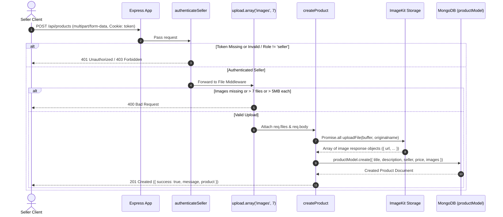

# Product Creation API Documentation

**Endpoint:** `POST /api/products`  
**Handler Route:** `router.post("/products", authenticateSeller, upload.array('images', 7), createProduct)`  
**Source Code References:**
- Route: [`product.routes.js`](file:///d:/Sheryian/full%20Stack%20Projects/Snitch/Backend/src/routes/product.routes.js#L8)
- Controller: [`createProduct`](file:///d:/Sheryian/full%20Stack%20Projects/Snitch/Backend/src/controllers/product.contoller.js#L5-L45)
- Middleware: [`authenticateSeller`](file:///d:/Sheryian/full%20Stack%20Projects/Snitch/Backend/src/middleweres/auth.middleweres.js#L5-L25) | [`upload.middleware.js`](file:///d:/Sheryian/full%20Stack%20Projects/Snitch/Backend/src/middleweres/upload.middleware.js#L5-L11)
- Model: [`product.model.js`](file:///d:/Sheryian/full%20Stack%20Projects/Snitch/Backend/src/models/product.model.js#L3-L38)
- Storage Service: [`storage.service.js`](file:///d:/Sheryian/full%20Stack%20Projects/Snitch/Backend/src/services/storage.service.js#L8-L20)

---

## 1. Overview & Architecture

The **Product Creation API** allows authenticated sellers to publish new products on the platform. It handles multi-part form data processing, image upload streaming to **ImageKit** cloud storage, and database entry persistence in **MongoDB**.



---

## 2. Authentication & Authorization

| Authentication Type | Cookie Parameter | Authorization Check |
| :--- | :--- | :--- |
| **HTTP Cookie** | `token` (JWT Token) | `req.user.role === "seller"` |

* If no `token` cookie is present or token is invalid: Returns **`401 Unauthorized`**.
* If the user's role is not `"seller"`: Returns **`403 Forbidden`**.

---

## 3. Request Specifications

### Request Headers
```http
POST /api/products HTTP/1.1
Host: localhost:3000
Content-Type: multipart/form-data; boundary=----WebKitFormBoundary7MA4YWxkTrZu0gW
Cookie: token=<JWT_AUTH_TOKEN>
```

### Form-Data Payload (`multipart/form-data`)

| Parameter | Type | Required | Description / Constraints |
| :--- | :--- | :--- | :--- |
| `title` | `String` | **Yes** | Product title/name. |
| `description` | `String` | **Yes** | Detailed description of the product. |
| `priceAmount` | `Number` | **Yes** | Price numerical value (e.g. `1499`). |
| `priceCurrency` | `String` | Optional | Currency code. Default: `"INR"`. <br/>**Enum:** `["USD", "EUR", "GBP", "JPY", "INR"]`. |
| `images` | `File[]` | **Yes** | 1 to 7 image files.<br/>**Max Size per File:** `5 MB` (`5 * 1024 * 1024` bytes). |

---

## 4. Response Specifications

### Success Response (`201 Created`)

**Status Code:** `201 Created`

```json
{
  "message": "product created successfully",
  "success": true,
  "product": {
    "_id": "66b5c3e41234567890abcdef",
    "title": "Oversized Streetwear Hoodie",
    "description": "Premium heavyweight cotton blend hoodie.",
    "seller": "66b5b1234567890abcdef123",
    "price": {
      "amount": 2499,
      "currency": "INR"
    },
    "images": [
      {
        "fileId": "66b5c3e49876543210fedcba",
        "name": "hoodie_front_12345.jpg",
        "url": "https://ik.imagekit.io/snitch/snitch/hoodie_front_12345.jpg",
        "thumbnailUrl": "https://ik.imagekit.io/snitch/tr:n-ik_ml_thumbnail/snitch/hoodie_front_12345.jpg",
        "height": 1200,
        "width": 1200,
        "size": 482019,
        "filePath": "/snitch/hoodie_front_12345.jpg"
      }
    ],
    "createdAt": "2026-08-09T18:17:23.100Z",
    "updatedAt": "2026-08-09T18:17:23.100Z",
    "__v": 0
  }
}
```

---

### Error Responses

#### 1. Missing Product Images (`400 Bad Request`)
Returned when no files are uploaded in the `images` field.
```json
{
  "message": "Product image is required"
}
```

#### 2. Unauthorized (`401 Unauthorized`)
Returned when JWT token is missing, invalid, or expired.
```json
{
  "message": "Unauthorized"
}
```

#### 3. Forbidden (`403 Forbidden`)
Returned when the authenticated user is not a seller (`user.role !== "seller"`).
```json
{
  "message": "Forbidden"
}
```

#### 4. Internal Server Error (`500 Internal Server Error`)
Returned when ImageKit upload or database insertion fails.
```json
{
  "success": false,
  "message": "Failed to create product"
}
```

---

## 5. Code Integration Examples

### cURL Example
```bash
curl -X POST http://localhost:3000/api/products \
  -H "Cookie: token=YOUR_SELLER_JWT_TOKEN" \
  -F "title=Oversized Streetwear Hoodie" \
  -F "description=Premium heavyweight cotton blend hoodie." \
  -F "priceAmount=2499" \
  -F "priceCurrency=INR" \
  -F "images=@/path/to/image1.jpg" \
  -F "images=@/path/to/image2.jpg"
```

### JavaScript (Frontend Fetch API)
```javascript
const formData = new FormData();
formData.append("title", "Oversized Streetwear Hoodie");
formData.append("description", "Premium heavyweight cotton blend hoodie.");
formData.append("priceAmount", 2499);
formData.append("priceCurrency", "INR");

// Assuming imageInput is an <input type="file" multiple />
for (let i = 0; i < imageInput.files.length; i++) {
  formData.append("images", imageInput.files[i]);
}

try {
  const response = await fetch("http://localhost:3000/api/products", {
    method: "POST",
    credentials: "include", // Sends cookie containing auth token
    body: formData,
  });

  const data = await response.json();
  if (response.ok) {
    console.log("Product created:", data.product);
  } else {
    console.error("Error:", data.message);
  }
} catch (error) {
  console.error("Network error:", error);
}
```

### Axios Example
```javascript
import axios from "axios";

const createProduct = async (productData, imageFiles) => {
  const formData = new FormData();
  formData.append("title", productData.title);
  formData.append("description", productData.description);
  formData.append("priceAmount", productData.priceAmount);
  formData.append("priceCurrency", productData.priceCurrency || "INR");

  imageFiles.forEach((file) => {
    formData.append("images", file);
  });

  try {
    const response = await axios.post("http://localhost:3000/api/products", formData, {
      withCredentials: true,
      headers: {
        "Content-Type": "multipart/form-data",
      },
    });
    return response.data;
  } catch (error) {
    throw error.response ? error.response.data : error;
  }
};
```
